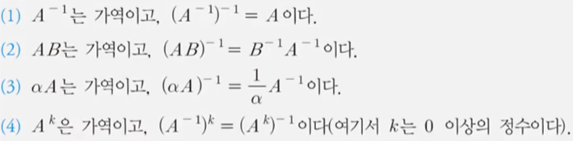
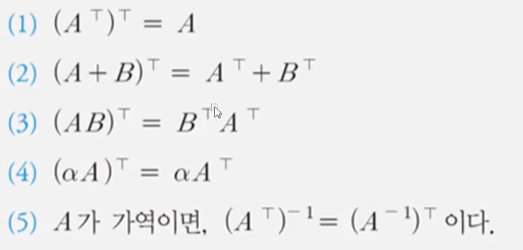
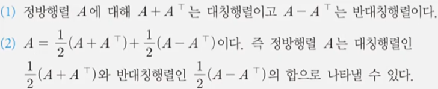
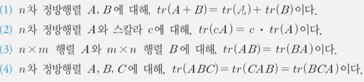

# Chapter 3. 행렬의 연산 및 역행렬
## 연립선형방정식을 쉽게 푸는 방법?
### 가우스-조던 소거법
* 변수가 2개인 일차 방정식 두개의 해를 구하는 방법으로 중학교때 많이 썼음
* 두 방정식을 이용해서 하나의 변수를 소거한 식을 만들어서 두 변수의 해를 구하는 방법
* 변수가 3개 이상인 방정식에서도 효율적인 방법임
* 또한 이 방법으로 정방행렬(suquare matrix)에 적용해 역행렬을 구할 수도 있음

* 연립성형방정식을 표현한 행렬방정식의 계수행렬 부분(A)을 기약행 사다리꼴 행렬(r.r.e.f)로 변환하여 해를 구하는 방법
* $Ax=b$에서 행 연산으로 A를 I로 만들면, 행렬방정식의 해를 구할 수 있음
#### 예시
[1 2 1][3]
[2 3 1][4]
[3 -2 -3][-1]

1. 1행에 -2곱해서 2행 1열을 0으로 만들고, 1행에 -3을 곱해서 3열 1행을 0으로 만들기
[1 2 1][3]
[0 -1 -1][-2]
[0 -8 -6][-10]
다시 정리
[1 2 1][3]
[0 1 1][2]
[0 8 6][10]
2. 2행에 -8을 곱해서 3행 2열 0으로 만들기
[1 2 1][3]
[0 1 1][2]
[0 0 -2][-6]
3행에 -1/2곱해서 정리
[1 2 1][3]
[0 1 1][2]
[0 0 1][3]
r.e.f
3. 3행을 1행과 2행에 빼서 3열의 1행 2행을 0으로 만들기
[1 2 0][0]
[0 1 0][-1]
[0 0 1][3]
4. 2행에 -2곱해 1행에 더함
[1 0 0][2]
[0 1 0][-1]
[0 0 1][3]
r.r.e.f완성
>> $x_1=2, x_2=-1, x_3=3$

### 행렬의 거듭제곱
정방행렬 A에 대해 A를 k번 곱한 $A^k$.

#### 성질
1. $A^0 = I$
2. $(A^b)^c = A^(bc)$
3. $A^b*A^c = A^(b+c)$
   1. b,c가 정수이고, 행렬A의 역원(A의 역행렬, $A^(-1)$)이 존재하면, 지수법칙이 성립한다.

### 역행렬
* 정방행렬 $A=[a_ij]_(nxn)$에 대해 $AB = BA = I_n$을 만족하고 여기서 B를 A의 역행렬(inverse matrix)라고 한다
* A의 역행렬은 $A^-1$로 나타낸다
* 역행렬은 실수 a의 역원 $a^-1$과 같은 역할을 한다
* 역행렬이 존재할 떄, $Ax=b$라는 행렬방정식에 대하여 $x=A^-1b$로도 구할 수 있다.(다른 방법은 가우스-소거법이다.)

### 어떤 방식으로 해를 구하는 것이 빠를까?
>> 가우스-소거법과 역행렬을 이용하는 것 중에서 더 빠른 방법은 가우스-소거법이다. 왜냐하면, 일반적으로 역행렬을 구하는 작업 자체가 오래걸리기 때문이다.(사람이 직접 구했을 때)

#### 역행렬의 uniqueness
>> n차 정방행렬의 역행렬이 존재한다면, 오직 하나이다.

#### 역행렬의 성질
>> n차 정방행렬 A,B가 가역(invertible, 역행렬이 존재)이고, a가 0이 아닌 스칼라일 때, 다음을 만족한다.

##### 증명
1. $AA^-1=I$에서 $A^-1$은 A의 입장에서 역행렬이다. $A^-1$의 입장에서의 역행렬은 A이다. 따라서 $(A^-1)^-1=A$이다
2. socks-shoes properity

### 전치행렬(transpose of A)
$A=(a_ij)$라고 할 때, $A^T=(a_ij)$를 A의 transpose라고 한다.

#### 전치행렬 성질

### 대칭행렬(symmetric)과 반대칭행렬(skew-symmetric)
* $A=A^T$인 행렬 A를 대칭행렬(대각선을 기준으로 대칭)
* $A=-A^T$인 행렬 A를 반대칭행렬(대각선을 기준으로 대칭이 아님)

#### 정방행렬의 표현 방법

### 대각행렬(diagonal matrix)
>> 정방행렬 $A=(a_ij)$에 대해 원소가 0일 때, i!=j이다. 즉, 대각선에 위치한 원소를 제외하고 모두 0인 행렬인 것이다. 그러므로 0행렬도 대각행렬이다.(대각선의 원소도 0일 수 있다.) 또한 단위행렬도 대각행렬에 해당한다.

* 같은 크기의 두 대각행렬의 곱은 대각행렬다.(결과인 행렬의 각 대각선의 원소는 두 행렬의 원소의 곱이다.)
* n차 정방행렬 A와 n차 대각행렬 D가 있을 때, AD=DA가 성립한다.

* 대각합(trace(A))
  * 정방행렬 A에서 대각원소들의 합을 trace of A(trace(A))라고 한다.

대각합의 성질

... AB와 BA는 다르지만 trace에서는 대각원소만을 취하기 때문에 trace의 입장에서는  같다.

### 삼각행렬(triangular matrix)
* upper triangular matrix(상삼각행렬)
  * $U=(u_ij)$에서 $i>j$일 때, 원소가 0인 경우
  * 상삼각행렬과 상삼각행렬의 곱은 상삼각행렬이다.
* lower triangular matrix(하삼각행렬)
  * $L=(l_ij)$에서 $i<j$일 때, 원소가 0인 경우
  * 하삼각행렬과 하삼각행렬의 곱은 하삼각행렬이다.
* 여기서 0이어야하는 경우 외에도 0인 경우가 있는 삼각행렬을 strictly 삼각행렬이라고 한다.

### 열벡터와 행벡터의 곱
* 크기가 m X 1인 벡터 u와 크기가 n X 1인 벡터 v가 있을 때(둘다 행벡터), $uv^T$의은 크기가 m X n인 행렬이 된다.($v^T$는 열벡터)
* u tensor v라고도 쓴다.

#### 행렬과 열벡터의 곱
* 크기가 m X n인 행렬A와 크기가 n X 1인 열벡터가 있다.
* 이 둘의 곱은 A의 각 열과 열벡터의 각 원소의 곱과 그 결과로 나온 열벡터의 합과 같다.

***
#### tips
* 수의 체계
  * 실수(field, 체) > 벡터 > 행렬 > 텐서로 자연스럽게 확정된다.
    * 실수는 0이 아닌 모든 수가 역원을 갖는다
    * 벡터는 합과 스칼라 곱이 정의되어있고, 벡터들이 모여 **벡터공간**(vector space)을 이룬다
    * 행렬은 $M_(n x m)(R) = {A|A는 실수R위에서의 m x n행렬}$인 벡터공간을 이룬다.