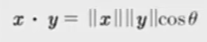
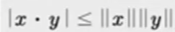
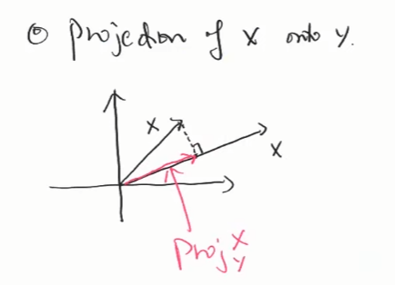
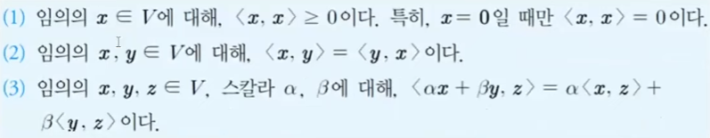
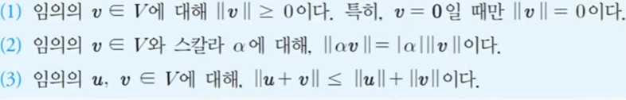

#### 기저 정리
벡터공간 V의 기저 $\beta=\{v_1,v_2,...,v_n\}$가 주어져 있을 때, V의 임의의 원소는 기저들의 선형결합으로 유일하게 표현된다. 즉, $v \in V$에 대하여 $v=a_1v_1+a_2v_2+...+a_nv_n$ for some a 스칼라들 (존재성) 그리고 이러한 a스칼라들이 유일하다(유일성)

존재성은 $\beta=\{v_1,v_2,...,v_n\}$가 span한다는 성질을 이용하여 증명한다.
유일성은 $\beta=\{v_1,v_2,...,v_n\}$가 linearly independent성질을 이용하여 증명한다.

### 차원(dimension of a vector space)
벡터공간 V의 기저 $\beta$의 개수를 **벡터공간의 차원**이라고 한다.   만약에 $\beta =\{v_1,v_2,...,v_n\}$라면 dim(V)=n(유한차원)이다. 그렇지 않다면 $dim(V)=\infty$(무한차원)라고 한다.

### 벡터의 크기(norm)
let $x = \(x_1,x_2,...,x_n\) \in R^n$, x의 크기norm는 $\vert\vert x \vert\vert= \sqrt{x_1^2,x_2^2,...,x_n^2}$ 즉, x의 크기는 원점0(0,0,...,0)과 x사이의 거리를 의미한다.

#### norm의 성질

(3)조건을 triangle inequality(삼각형 부등식)이라고 한다.

### 벡터의 내적
>>let $x = \(x_1,x_2,...,x_n\), y=\(y_1,y_2,...,y_n\) \in R^n$, 두 벡터 x,y의 내적(inner product)는 $x \cdot y=x_1y_1+x_2y_2+...+x_ny_n \in R$로 정의한다. 이 내적을 usual inner product 또는 euclidean inner product라고도 한다. 즉, 두 벡터를 곱해서 하나의 실수값으로 표현하는 함수이다.

* 두 벡터가 직교orthogonal한다는라는 뜻은 내적이 0이라는 것이다. 반대도 가능
* 피타고라스 정리에서 두 벡터의 합의 크기의 제곱과 각벡터의 크기의 제곱의 합이 같으면 직교한다.(증명은 두 벡터의 합의 크기의 제곱이 두 벡터의 합의 제곱이 같다는 것으로 할 수 있다.)

#### 내적의 성질

(5)$x \cdot x= \(x_1,x_2,...,x_n\) \cdot \(x_1,x_2,...,x_n\)$
    $=(x_1)^2+(x_2)^2+ ... + (x_n)^2$
    $= {\vert\vert x \vert\vert}^2 >= 0$

(6) trivial

#### 내적과 사잇각

단 여기서 $cos(\theta)$는 x,y가 이루는 각 $\theta$에 대한 cosine값.

#### 코시-슈바르츠 부등식

증명은 사잇각공식을 이용

#### triangle inequality 
$\vert\vert x \vert\vert + \vert\vert y \vert\vert >= \vert\vert x+y \vert\vert$

벡터의 합은 두 벡터로 이루어진 사다리꼴의 긴 대각선이기 때문에 사다리꼴을 반으로 나눠 삼각형으로 보면 빗변은 남은 두변의 합보다 작거나 같을 수 밖에 없다.(같은 경우는 사다리꼴이 아닌 직선이 만들어짐)

### 정사영(orthogonal projection)
>> 어떤 공간에 있는 것을 더 작은 공간으로 내리는 것
$R^n$에 있는 임의의 두벡터 x,y에 대하여, 벡터 x의 y방향의 벡터를 x의 y위로의 **정사영**이라고 한다. 영어로는 projection x onto y라고 읽고 $proj_{y}x$라고 쓴다

여기서 x와 y에 정사영한 x의 끝을 이은 벡터가 정사영한 벡터와 직교한다.
따라서 proj x onto y와 x - proj x onto y의 내적은 0. 직교한다.

정사영을 dot product로 표현하면 다음과 같다.
$Proj_{y}x= \frac{x\cdot y}{y\cdot y}y$
예시로 x=(1,1), y=(2,0)일 때 정사영은 (1,0)이다
또 x=(0,1), y=(c,0)일 때는 0이다. 왜냐하면 두 벡터가 직교하기 때문에 정사영을하면 점이되기 때문이다.

### 내적공간
실벡터공간 V(실수위에서 정의된 벡터공간)에 속하는 임의의 두 벡터 x,y에 대하여 다음의 세가지 조건을 만족하는 함수를 x와 y의 내적이라고 하고 <x,y>또는 $x\cdot y$라고도 쓴다.

벡터의 내적은 $\sum_{i=i}^{n} x_{i}y_i$로 표현되고, 벡터공간에 행렬(n X m)의 모임이 있을 때는 내적을 이중포문처럼 각행의 시그마(n만큼)와 그 시그마의 시그마(m만큼)이다.
이 내적의 의미는 행렬 A와 B의 성분끼리의 곱들의 합. 즉 이것은 1 x n행렬인 n차원 벡터의 내적을 행렬로 자연스럽게 확장한 것이다.

### 노름공간(normed space)
>> 벡터공간 V가 주어지고, 임의의 v에 대하여 실수 값으로 v의 크기가 정의되고 다음을 만족할 때, 이 벡터공간을 노름공간normed space라고 한다.

노름공간 필요충분조건

* 내적공간은 노름공간이 될 수 있지만, 노름공간에서 노름이 정의되어있다고 해서 내적이 정의되지는 않음으로 내적공간이 되지는 않는다.(정은 되지만 역은 불가)

### 그래디언트(gradient)
>> 다변수함수 $f\(x_1,x_2,...,x_n\)$에 대하여 벡터 $x=\(x_1,x_2,...,x_n\)$에 대한 미분의 정의는 $\Delta f= \frac {\partial f}{\partial x}=$각 x의 미분값이 원소로 있는 열벡터이다.이것을 f의 그래디언트라고한다.

* $\partial$은 기능적으로 미분기호이며, 모든 값에 대해 미분한다는 뜻이고 라운드라고 읽는다.
* $f=\(x,y,z\)=xyz라고 할때, f를 미분하면 x에 대해 미분하면 yz, y에 대해 미분하면 xz, z에 대해 미분하면 xy가 되서 이 3개 값을 원소로 가지는 열벡터가 된다.
