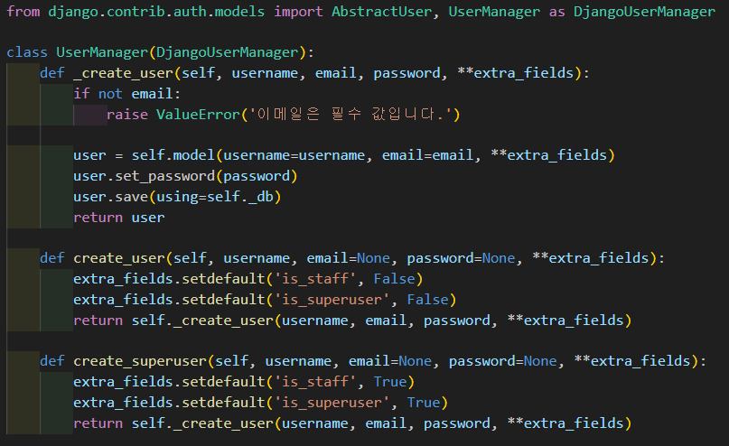

 # 실습
 ## form
 * form.py를 통해 구현
 * from django import forms
 * forms.Form을 클래스에 상속받아서 구현

### 기능
* form(html)자동완성
  1. form.py에서 데이터를 담을 모델같은 클래스를 만든다
  2. 데이터를 담을 변수를 만듦
  3. view에서 form의 클래스를 받아와서 모델 처럼 인스턴트화 시킨다.
  4. GET요청일 때, render함수에 context항목에 인스턴트된 폼을 넘긴다.
  5. html에서 인스턴트된 폼을 적기만해도 자동으로 입력받기위해 html태그가 생성된다.
     * e.g.){{ form.as_p }}
     * 이 경우에는 p태그로 입력받기 위한 html문을 작성한다.
     * form.as_table, form.as_ul 등 원하는 태그로 작성하게 할 수도 있다.
  * forms.py에서 클래스의 변수에서 위젯을 설정해서, 구체적으로 어떤 형식으로 데이터를 받을 것인지 위젯을 설정할 수 있다.
    * e.g) content = forms.CharField(label='내용',widget=forms.Textarea, required=True)
    * 이 경우에는 textarea 형태로 텍스트를 받아온다.

* 유효성 검사
  * POST로 데이터를 받으면, 그 데이터가 유도한 데이터에 맞는 형식인지를 확인해야한다
  * 여기서 form을 사용하면, is_valid()와 같이 form데이터가 유효한지
  * 혹은 cleand_data[]으로도 할 수 있다.
    * clean함수는 from.py단에서 커스텀할 수 있다.(예를 들어 비속어가 들어오면 막는다던지)

#### 모델 상속받기
* from.py에서 기존의 모델을 상속받아서 쓸 수 있다
  1. forms.ModelForm을 상속 받는다
  2. 클래스 안에서 Meta클래스를 선언한다
  3. model 변수에 사용할 모델 클래스를 넣어준다
  4. field변수에 사용할 필드를 선언해준다.
     * 모든 필드를 넣으려면 '__all__'로 선언
     * 일부라면, 리스트 형으로 필드명을 넣어준다

## User 모델
* User는 기본적으로 장고에서 제공하는 모델이 있지만, 커스텀을 하기 위해 사용된다.
  1. User모델을 다룰 앱을 만든다
  2. models.py에 상속받고 싶은 유저 클래스를 import한다
  3. 클래스를 만들고 상속받는다
  4. 클래스에 커스텀 내용을 넣는다
  5. 마이그레트
     * makemigration과 migrate차이
     * 전자는 선언된 모델을 데이터베이스에 넣기 위해 코드로 스키마의 틀을 만들어서 migrations폴더에 넣어준다
     * 후자는 migrations에 있는 스키마내용을 실제로 데이터베이스에 만들어준다

### UserManager
* 유저를 슈퍼유저와 일반유저를 구분하여 생성해주는 함수를 포함한 클래스

### UserCreationForm
* 장고에서 만들어논 클래스로서 계정 생성에 관한 정보, 유저네임, 이메일, 패스워드 등을 받는 변수가 있고, 유효성 검사까지 해주는 클래스이다.
* 직접 커스텀해서 관리해도 되지만, 이미 만들어 놓은 이 클래스를 사용하는게 유리하다
* 왜냐하면, 기본적으로 구현해야하는 범용적인 기능들을 거의 구현해 놓았기 때문에, 만약 추가적인 기능이 필요하다면, 그 부분만 추가해서 커스텀하면 되기 때문이다.

### AuthenticationForm
* 계정정보에 대한 폼을 가지고 있으면서 동시에 유효성 검사도 해주는 폼

## 권한과 인증
!
### Session
* 웹에서 로그인을 했을 때, 다음 페이지로 이동했을 때도 로그인했다는 정보를 알고있어야함
* 그래서 세션이라는 로그인 정보를 쿠키에 저장해서 그것으로 어떤 사용자가 로그인 했는지 판단함(로그인 시, 세션 값을 데이터베이스에서도 같은 값을 저장함. 그것으로 비교할 수 있음.)
* 로그아웃시, 세션을 삭제함(만약, 데이터베이스에서 세션 값을 삭제하고, 웹을 새로고침하면, 로그아웃됨. 쿠키 세션값이 데이터베이스에 있지 않기 때문에)

***
##### tips
* 통상적으로 함수에 언더바가 앞에 있는 경우 숨겨진 함수를 뜻함.
* urls.py의 주소로 타고갈때 path에 있는 view의 함수를 불러오는데 이 과정이 GET요청이었다.
* 그래서 GET요청시 view에서 해줘야할 기능을 구현하는 것이다.
* view.py에서 코딩할 시 기본적으로 GET과 POST단을 if else로 구분해서 코딩하고
* 그 안에서 로직을 미리 주석으로 작성하면서 전체적인 설계를 마치고 코딩하는 것이 현명하다
* 장고에서 수많은 기능을 만들어 놨고, 검증되어있다
* 그렇기 때문에 굳이 직접 치면서 검증되지 않은 코드를 작성하는 것보다, 만들어진 것들을 이용하는게 도움이 된다.(생산성의 문제)
* 쿠키: 클라이언트가 웹을 새로고침하거나, 이동해도 보관하고 싶은 정보를 저장하는 작은 공간

##### Question
* 만들어진 기능을 사용하는 것이 생산성 측면에서 좋지만, 직접 막힘없이 구현할 수 있는 기능일때 장고 기능을 사용하는 것과, 직접 구현이 힘든 상황에서 장고 기능을 사용하는 것에는 차이가 있을 거 같다. 후자의 경우에도 생산성을 위해 장고 기능을 그대로 사용하는 것이 맞는지