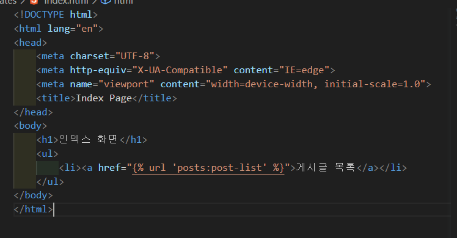
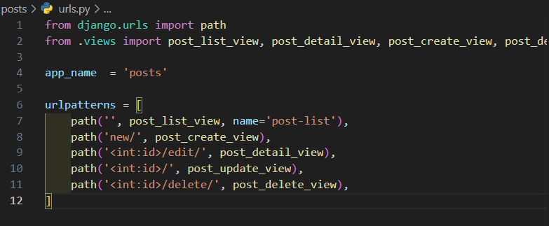

# 4-1 Views를 만드는 2가지 방법
View: 웹 요청을 수신하고 응답하는 파이썬 함수 또는 클래스
1. FBV(Function Based Views)
   * 장점
     * 구현이 간편함
     * 읽기 쉬우며 직관적인 코드
     * 데코레이터의 간단한 사용법
   * 단점
     * 코드 확장과 재사용이 어려움
     * 조건부 분기를 통한 HTTP 메서드 처리가 필요하다
>> 일회성, 특수 목적이 있는 View에 적합
***
1. CBV(Class Based Views)
   * 장점
     * 코드 확장과 재사용 용이
     * 다중 상속, Mixin 가능
     * 내장 Class Based View 사용(ListView, CreatView, DetailVeiw등..)
   * 단점
     * 읽기 어려우며 복잡도가 높음
     * 데코레이터 사용 시 함수를 재정의 해야 함  
>> 일반적인 생성, 조회, 수정, 삭제 등의 View에 적합

>> FBV와 CBV는 좋고 나쁘고를 판단하기 보다 상황에 적합한 방식을 선택하는 것이 바람직하다.

## 실습
* 인터프리터 경로 설정 보거>명령팔레트>파이썬 인터프리터 설정>찾기>venv/Scripts/python.exe후에 새 터미널 열기
* 현재 인터프리터 경로 보기
  * 터미널에 $ python입력으로 파이썬 열기
  * $ import sys
  * $ sys.excutable를 입력하면 절대경로가 나옴
* views.py에서 요청을 처리하는 함수는 매개변수로 request를 꼭 적는다.

### 웹에서 값을 입력받는 방법
1. urls.py에서 <자료형:변수명>형태를 적어서 변수형태로 값을 받아 올 수 있다.
2. 주소에 ?key=value를 붙여주면 request.GET으로 받아서 딕셔너리로 쿼리딕셔너리로 출력할 수 있다.

3. html에 from태그에 method속성을 GET으로 하면 input태그에 name속성의 값을 키값으로 받은 값을 value값으로 딕셔너리 형태로 값을 받을 수 있다.(단순히 값만 넘기는 경우)
4. 같은 방법으로 method를 POST로 받을 수 있다.(보통 추가, 삭제, 수정의 경우)

* 클래스를 url에 인자로 전달하기 위해서는 클래스.as_view()라고 써야한다.

### cbv의 장점
* 클래스기반이기 때문에 장고에 미리 만들어진 클래스를 상속 받는 것 만으로도 다양한 기능을 그대로 쓸 수 있다.(생산성이 높음)

# 4-5 Django Templates Engine 알아보기 (1)
## 장고 실행 흐름
* 클라이언트
  1. 브라우저가 요청을 날림
  3. 날아온 응답을 랜더링을 함
* 서버
  2. view가 요청을 받아 template의html,css,js를 응답으로 날림(서버에서 html을 해석해서 응답을 보내는 것임>>**teplate은 서버에서 실행된다.**)
[공식문서](https://docs.djangoproject.com/en/4.0/topics/templates/)

### Template 태그

[공식문서](https://docs.djangoproject.com/en/4.0/ref/templates/builtins/#built-in-tag-reference)

### Template 상속
부모의 html을 상속받아 자식 html에서 그대로 쓰는 기능

### Template 필터

[공식문서](https://docs.djangoproject.com/en/4.0/ref/templates/builtins/#built-in-filter-reference)

# 실습
## url 태그 활용
에서 url_name과 일치하는 절대 경로로를 참조한다.
! app_name을 posts로 선언해야 되는 이유는 default는 config의 urls.py이고 app_name을 posts로 선언해야 posts의 urls.py인줄알고 참조하는 걸까?

스태틱파일 서비스제공자 기획자 마케터가 올리는 서비스 자원
미디어파일 사용자가 올리는 파일
구글폰츠에서 무료 아이콘 사용가능

img 태그에 이미지가 안나오는 오류가 뜰 때를 방지해서 이미지 자리에 빈칸 개념으로 들어가는 이미지로 아래 링크를 자주쓴다.
http://via.placeholder.com/32x32
맨 뒤에 붙는 숫자만큼 이미지 크기가 정해진다.